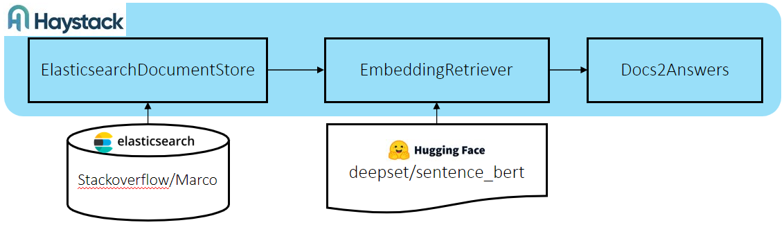
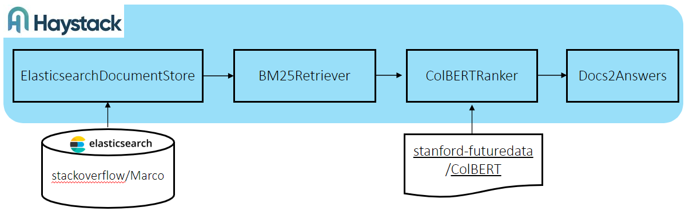
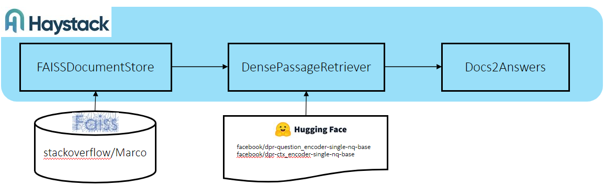

### Introduction
This repository is an open domain question answering(ODQA) framework forking from [haystack 1.12.2](https://haystack.deepset.ai/overview/intro), and you can find more detailed information on their [github](https://github.com/deepset-ai/haystack). We provide three Optimized experimental pipelines including:

- Generate the database indexing of [StackOverflow](https://www.kaggle.com/datasets/stackoverflow/stacksample) and [MS Marco](https://microsoft.github.io/msmarco/) dataset on Ray cluster
- Run the full workflow with generated database indexing and pipelines. 

### Dependencies
##### Install Docker and Docker Compose
**Note:** If you have docker and docker-compose installed on your machine, then skip this.

```bash
# change to sudo privileges
sudo su
# run shell script (support Red Hat Linux)
./prepare_env.sh
```

### Step-by-step Instructions
#### 1. Download the source code
```bash
git clone https://github.com/intel/open-domain-question-and-answer.git
cd open-domain-question-and-answer/
git submodule update --init --recursive
```

#### 2. Prepare work
#### Set proxy
docker container need to download model from [Huggingface](https://huggingface.co/) and install related dependencies from Internet, hence we may need to set environment param of proxy for it. Here we map HTTP_PROXY and HTTPS_PROXY from host to the docker container. So please set correct environment param for HTTP_PROXY and HTTPS_PROXY on the host machine. 
#### Prepare the searching database and faiss indexing files.
Please refer to [applications/Indexing](./applications/indexing)


#### 3. Run workflow Commands

Go to applications/odqa-pipelines 
```bash
cd applications/odqa_pipelines
```

- Pipeline1: ElasticsearchDocumentStore->EmbeddingRetriever(deepset/sentence_bert)->Docs2Answers
  
  <p align="center"> <br></p>

  Modify the config files:

  config/env.stackoverflow.esds_emr_faq

  ```bash
  # set the $data_dir to the data folder of elasticsearch database, please refer to applications/indexing/stackoverflow_indexing_workflow.yml
  DATA_DIR=$data_dir 
  ```
  
  config/env.marco.esds_emr_faq
   ```bash
  # set the $data_dir to the data folder of elasticsearch database, please refer to applications/indexing/marco_indexing_workflow.yml
  DATA_DIR=$data_dir 
  ```
  Run workflows: 

  ```bash
  #stackoverflow database
  docker-compose -f docker-compose/docker-compose.yml --env-file config/env.stackoverflow.esds_emr_faq up
  #marco database
  docker-compose -f docker-compose/docker-compose.yml --env-file config/env.marco.esds_emr_faq up
  ```
- Pipeline2: ElasticsearchDocumentStore->BM25Retriever->ColbertRanker-> Docs2Answers

  <p align="center"> <br></p>

  Modify the config files:

  config/env.stackoverflow.esds_bm25r_colbert

  ```bash
  # set the $data_dir to the data folder of elasticsearch database, please refer to applications/indexing/stackoverflow_indexing_workflow.yml
  DATA_DIR=$data_dir
  # set the $customer_dir to the absolute ColbertV2.0 model path you placed
  CUSTOMER_DIR=$customer_dir
  ```
  
  config/env.marco.esds_bm25r_colbert
   ```bash
  # set the $data_dir to the data folder of elasticsearch database, please refer to applications/indexing/marco_indexing_workflow.yml
  DATA_DIR=$data_dir
  # set the $customer_dir to the absolute ColbertV2.0 model path you placed
  CUSTOMER_DIR=$customer_dir
  ```

  docker-compose/docker-compose.yml
  
  Uncomment the following lines.
   ```bash
    #volumes:
    #  - $CUSTOMER_DIR:/home/user/data
  ```


  Run workflows:
  ```bash
  #stackoverflow database
  docker-compose -f docker-compose/docker-compose.yml --env-file config/env.stackoverflow.esds_bm25r_colbert up
  #marco database
  docker-compose -f docker-compose/docker-compose.yml --env-file config/env.marco.esds_bm25r_colbert up
  ```
- Pipeline3：FAISSDocumentStore->DPR→Docs2Answers

  <p align="center"> <br></p>

  Modify the config files:

  config/env.stackoverflow.faiss_dpr

  ```bash
  # set the $data_dir to the data folder of postgresql database, please refer to applications/indexing/stackoverflow_indexing_workflow.yml
  DATA_DIR=$data_dir
  # set the $customer_dir to the absolute path where you store faiss indexing files.
  CUSTOMER_DIR=$customer_dir
  ```
  
  config/env.marco.faiss_dpr
   ```bash
  # set the $data_dir to the data folder of postgresql database, please refer to applications/indexing/marco_indexing_workflow.yml
  DATA_DIR=$data_dir
  # set the $customer_dir to the absolute path where you store faiss indexing files.
  CUSTOMER_DIR=$customer_dir
  ```

  docker-compose/docker-compose-dpr.yml
  
  Uncomment the following lines.
   ```bash
    #volumes:
    #  - $CUSTOMER_DIR:/home/user/data
  ```

  Run workflows:

  ```bash
  #stackoverflow database
  docker-compose -f docker-compose/docker-compose-dpr.yml --env-file config/env.stackoverflow.faiss_dpr up 
  #marco database
  docker-compose -f docker-compose/docker-compose-dpr.yml --env-file config/env.marco.faiss_dpr up 
  ```
