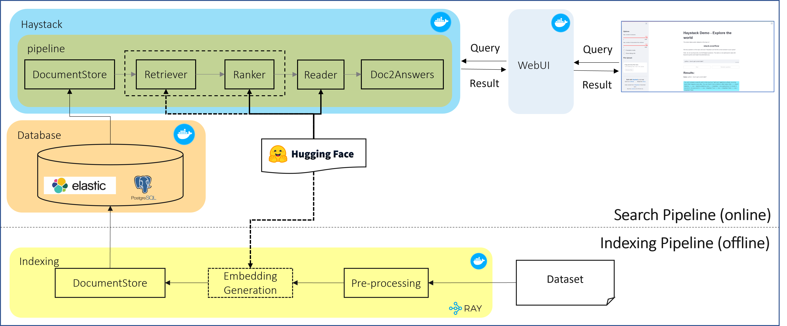
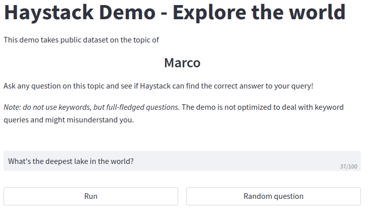

# Open Domain Question and Answer

## Introduction
Open Domain Question Answering (ODQA) is an important task in Natural Language Processing (NLP), which aims to answer a question in the form of natural language based on large-scale unstructured documents. This repository is an open domain question answering(ODQA) framework forking from [haystack 1.12.2](https://haystack.deepset.ai/overview/intro), and you can find more detailed information on their [github](https://github.com/deepset-ai/haystack). We provide three optimized experimental pipelines including:

- Generate the database indexing on Ray cluster
- Run the full workflow with generated database indexing and pipelines. 

Check out more workflow examples in the [Developer Catalog](https://developer.intel.com/aireferenceimplementations).

## Solution Technical Overview
Enterprises are accumulating a vast quantity of documents. These documents contain a large amount of valuable information, but it is a challenge for enterprises to index, search and gain insights from the document.

In this workflow, we provide a end-to-end solution for user to gain insights from large amount of documents, along with 3 optimized pipelines. This workflow also support customization to cover your own dataset. The architecture of the workflow is shown in the figure below.

<p align="center"> <br></p>

## Solution Technical Details
This workflow is composed of 2 pipelines, including offline indexing pipeline and online search pipeline. The indexing pipeline is responsible for processing dataset, generating document embedding and saving indexing file to DocumentStore. Indexing pipeline is built based on haystack pipeline and supports distributed execution with Ray. The search pipeline loads indexing file from database, retrieves documents according to query question and generate most relevant answer. A web UI will be deployed to provide query service.

## Validated Hardware Details 
| Supported Hardware           | Requirements  |
| ---------------------------- | ---------- |
| Intel® 1st, 2nd, 3rd, and 4th Gen Xeon® Scalable Performance processors| FP32 |
| Memory | >376 GB |
| Storage | >200 GB |

>Note: This workflow is verified with OS Rocky 8.7 and Python 3.6.8.

## How it Works
### Indexing Pipeline
We need to generate document indexing to retrieve documents from document store, the generated indexing file will be stored in database. Indexing pipeline contains 3 tasks:

1. Pre-processing: load and extract raw dataset, convert data into haystack [Document](https://docs.haystack.deepset.ai/docs/documents_answers_labels) object.

2. Embedding generation: generate vector representations of text passages using pre-trained encoder model from Hugging Face and then generate indexing file with the vectors. The indexing file will be used in retrieval phase, retriever will use query vector to search against indexing file to find the highest similarity to the query vector. It can take days to generate document indexing file based on type and number nodes you are using, we provide multi-node distributed indexing pipeline with Ray to  accelerate the indexing process.

3. Write document store: generated indexing file will be written to haystack [DocumentStore](https://docs.haystack.deepset.ai/docs/document_store) and stored in database.

### Search Pipeline
The search pipeline consists of haystack REST API and web UI to support deploy in web. With search pipeline deployed, users can interact with the document search system through a web UI and submit queries in natural language. The retriever will search the most relevant documents in the databases, ranker will rerank the documents to have a better sorted list of relevant documents and reader takes a question and a set of documents as input and returns an answer by selecting a text span within the documents

## Get Started
### Step 1. Install Docker and Docker Compose
>Note: If you have docker and docker-compose installed on your machine, then skip this.

You'll need to install Docker Engine on your development system. Note that while **Docker Engine** is free to use, **Docker Desktop** may require you to purchase a license.  See the [Docker Engine Server installation instructions](https://docs.docker.com/engine/install/#server) for details.

To build and run this workload inside a Docker Container, ensure you have Docker Compose installed on your machine. If you don't have this tool installed, consult the official [Docker Compose installation documentation](https://docs.docker.com/compose/install/linux/#install-the-plugin-manually).

We provide a shell script to install docker and docker compose

```bash
# change to sudo privileges
sudo su
# run shell script (support Red Hat Linux)
./prepare_env.sh
```

### Step 2. Download the Workflow Repository
```bash
git clone https://github.com/intel-sandbox/applications.ai.appliedml.workflow.odqa.git
cd applications.ai.appliedml.workflow.odqa/
git submodule update --init --recursive
```

### Step 3. Set Proxy (optional)
docker container need to download model from [Huggingface](https://huggingface.co/) and install related dependencies from internet, hence we may need to set environment param of proxy for it. Here we map http_proxy and https_proxy from host to the docker container. So please set correct environment param for http_proxy and https_proxy on the host machine. 

### Step 4. Download the Datasets
[MS Marco](https://microsoft.github.io/msmarco/) Question Answering and Natural Langauge Generation dataset consists of a question answering dataset featuring 100,000 real Bing questions and a human generated answer, and The Natural Language Generation dataset features 180,000 examples and builds upon the QnA dataset to deliver answers that could be spoken by a smart speaker

```bash
# Download Marco dataset
mkdir marco
cd marco
wget https://msmarco.blob.core.windows.net/msmarco/train_v2.1.json.gz
gunzip train_v2.1.json.gz
```
### Step 5. Download the colbertv2.0 Model (Optional)
>Note: If you will not try the colbert pipelines, skip it.

```bash
# download the colbert model
wget https://downloads.cs.stanford.edu/nlp/data/colbert/colbertv2/colbertv2.0.tar.gz
tar -xvzf colbertv2.0.tar.gz
```

### Step 6. Set Up Docker Image
Pull docker images from dockerhub

```bash
docker pull intel/ai-workflows:odqa-haystack-api
docker pull intel/ai-workflows:odqa-haystack-ui
```

Or build docker images

```bash
cd applications/indexing
./build_img.sh
```

If your environment requires a proxy to access the internet, export your development system's proxy settings to the docker environment:
```bash
export DOCKER_RUN_ENVS="-e ftp_proxy=${ftp_proxy} \
  -e FTP_PROXY=${FTP_PROXY} -e http_proxy=${http_proxy} \
  -e HTTP_PROXY=${HTTP_PROXY} -e https_proxy=${https_proxy} \
  -e HTTPS_PROXY=${HTTPS_PROXY} -e no_proxy=${no_proxy} \
  -e NO_PROXY=${NO_PROXY} -e socks_proxy=${socks_proxy} \
  -e SOCKS_PROXY=${SOCKS_PROXY}"
```

## Run Indexing Pipeline
Go to indexing pipeline folder

```bash
pip install pyyaml
cd applications/indexing
```

### Step 1. Modify the Indexing Workflow YAML File
Modify `applications/indexing/marco_indexing_workflow.yml' according to your system environment. The YAML file must include a head node. The head node should be your local machine which launches the indexing workflow. You can add the worker node under the nodes component for distributed pipeline execution.

The pipelines component declares the pipelines that need to be executed, and declares the database used by each pipeline. The YAML files of these pipelines are included in $workspace_dir which is ./marco_indexing for marco dataset.

Key configuration variables are listed in the table bellow

| Environment Variable Name | Mount Point | Description |
| --- | --- | --- |
| $workspace_dir | `/home/user/workspace` | Include the pipeline YAML files, prepare_env.sh and python file of dataset class for preprocessing and converting dataset data to documents or files of Ray dataset. |
| $customer_dir | `/home/user/data` | The log will be saved in the directory. You also can copy your model into this direcotry. For example, indexing workflow of colbert_indexing_pipeline.yml needs the colbertv2.0 model. Copy colbertv2.0 folder into this directory. |
| $dataset_dir | `/home/user/dataset` | The directory include the dataset files |
| $data_dir | database storage dir | if $data_dir is not exist, it will be created. Please use different directory path for different pipeline. |

### Step 2. Modify the Indexing Pipeline YAML Files in $workspace_dir
In pipeline YAML files there are some parameters need to be modified. These pipeline YAML files is under your $workspace_dir. 

For example：

./marco_indexing/colbert_indexing_pipeline.yml
./marco_indexing/emr_indexing_pipeline.yml
./marco_indexing/faiss_indexing_pipeline.yml

Edit these YAML files according to your local runtime environment.

- For DocumentStore you need to specify the address of the linked database. The $host_ip should be the host IP of head node, because the database container is launched on head node.

- Check the files path of $customer_dir and $dataset_dir. They are mounted into containers of Ray head and workers. They should include the dataset files or finetuned models downloaded by yourself. If there are subdirectories in these directories, please modify the corresponding path.

- Adjust the actor numbers and batch_size according to the hardware resource of the Ray cluster. Too large actor numbers and batch_size may cause out of memory. The num_replicas x num_cpus should be less than the total number of CPUs you configured in the indexing workflow YAML.

  ```yaml
  serve_deployment_kwargs:
      num_replicas: 80  # number of actors to create on the Ray cluster
      batch_size: 256
      num_cpus: 2
  ```

### Step 3. Generate Marco Database
Launch the Ray cluster for indexing workflows.
```bash
#Launch Ray cluster for marco indexing workflow
$ python launch_indexing_workflow.py -w marco_indexing_workflow.yml
```

Run the indexing workflows on Ray cluster. The `-p` option value is the name of pipeline YAML file or all.

 **Note:**
 For faster debugging and demonstration demo, you can choose the Marco dataset and use the -s option to take only 500 samples from dataset for indexing

```bash
#Run all pipelines defined in marco_indexing_workflow.yml
$ python launch_indexing_workflow.py -w marco_indexing_workflow.yml -p all

#Run faiss_indexing_pipeline.yml defined in the marco_indexing_workflow.yml
$ python launch_indexing_workflow.py -w marco_indexing_workflow.yml -p faiss_indexing_pipeline.yml

#Run faiss_indexing_pipeline.yml defined in the marco_indexing_workflow.yml, only take 500 samples from dataset for indexing pipeline debugging or demo.
$ python launch_indexing_workflow.py -w marco_indexing_workflow.yml -p faiss_indexing_pipeline.yml -s 1
```

After generating the database of Faiss pipeline, copy and save the indexing files of $customer_dir to avoid them being overwritten by the new faiss indexing workflow.

Clean previous containers you have ran, you can use following commands on all nodes of your Ray cluster.

```bash
# Clean all the Ray and database containers running in local node.
$ ./run-ray-cluster.sh -r clean_all
# Clean all the database containers running in local node.
$ ./run-ray-cluster.sh -r clean_db
```

## Run Search Pipeline
The search pipeline is config-driven and containerized. There are 4 config files for user to customs deployment of search pipeline.
1. environment config file that sets environment variables for docker-compose
2. pipeline config yaml file that defines haystack components and pipeline
3. UI config yaml file that defines web UI properties
4. docker compose yaml file that defines how to launch search pipeline

We provide 3 types of search pipelines with different retriever, including EmbeddingRetriever, BM25Retriever + ColbertRanker and DensePassageRetriever, you can decide to deploy which type of pipeline with just a few configurations.

First make sure you are in `applications/odqa-pipelines` folder of the repo

```bash
cd applications/odqa_pipelines
```

### Option 1. Run EMR Pipeline
>Note: Please make sure you have completed emr_indexing_pipeline.yml indexing pipeline

ElasticsearchDocumentStore->EmbeddingRetriever(deepset/sentence_bert)->Docs2Answers
  
<p align="center"> <br></p>
  
Modify the config file `config/env.marco.esds_emr_faq`

```bash
# set the $data_dir to the data folder of elasticsearch database, please refer to applications/indexing/marco_indexing_workflow.yml
DATA_DIR=$data_dir 
```

Run workflow: 

```bash
#deploy search pipeline with marco database
docker-compose -f docker-compose/docker-compose.yml --env-file config/env.marco.esds_emr_faq up
```

### Option 2. Run Cobert Pipeline
>Note: Please make sure you have completed colbert_indexing_pipeline.yml indexing pipeline

ElasticsearchDocumentStore->BM25Retriever->ColbertRanker-> Docs2Answers

<p align="center"> <br></p>

Modify the config file `config/env.marco.esds_bm25r_colbert`

```bash
# set the $data_dir to the data folder of elasticsearch database, please refer to applications/indexing/marco_indexing_workflow.yml
DATA_DIR=$data_dir
# set the $customer_dir to the absolute ColbertV2.0 model path you placed
CUSTOMER_DIR=$customer_dir
```

Modify the docker compose file `docker-compose/docker-compose.yml`, uncomment the following lines.
```bash
  #volumes:
  #  - $CUSTOMER_DIR:/home/user/data
```

Run workflow:

```bash
#deploy search pipeline with marco database
docker-compose -f docker-compose/docker-compose.yml --env-file config/env.marco.esds_bm25r_colbert up
```

### Option 3. Run DPR Pipeline
>Note: Please make sure you have completed faiss_indexing_pipeline.yml indexing pipeline

FAISSDocumentStore->DensePassageRetriever->Docs2Answers

<p align="center"> <br></p>

Modify the config file `config/env.marco.faiss_dpr`

```bash
# set the $data_dir to the data folder of postgresql database, please refer to applications/indexing/marco_indexing_workflow.yml
DATA_DIR=$data_dir
# set the $customer_dir to the absolute path where you store faiss indexing files.
CUSTOMER_DIR=$customer_dir
```

Modify the docker compose file `docker-compose/docker-compose-dpr.yml`, uncomment the following lines.

```bash
  #volumes:
  #  - $CUSTOMER_DIR:/home/user/data
```

Run workflows:

```bash
#deploy search pipeline with marco database
docker-compose -f docker-compose/docker-compose-dpr.yml --env-file config/env.marco.faiss_dpr up 
```

## Expected Output
Once you deployed search pipeline successfully, open a browser and input following url to access web UI

```bash
<host_ip>:8501
```

The webpage should be like the below one

<p align="center"> <br></p>

## Summary and Next Steps
You have just run through an end-to-end open domain question and answer workflow composed of indexing and search pipelines on MS Marco dataset. With this workflow deployed successfully, you are able to query on a large amount of data source with natural language. You can also select different retriever for different needs.

Next you can customize the workflow to your own use case by following the customization sections below.

### Customize this Workflow to Your Own Use Case
We provide quick start [guide](doc/workflow_stackoverflow.md) on StackOverflow dataset for reference on how to customize this workflow to other dataset.

#### Adopt to your dataset
Copy your dataset to $dataset folder configured in indexing workflow yaml file

#### Customize indexing pipeline
ODQA indexing pipeline is built based on haystack pipeline, which requires a specific format of dataset. We provide [MS Marco dataset processing](applications/indexing/marco_indexing/marco_dataset.py) and [StackOverflow dataset processing](applications/indexing/stackoverflow_indexing/stackoverflow_dataset.py) script, for customer dataset integration with haystack, please refer to [haystack tutorial](https://docs.haystack.deepset.ai/docs/document_store).

In this workflow, we provide 3 types of passage embedding models, you can also use other models, just change embedding model name in indexing yaml file. Since indexing pipeline is config-driven, all configurations you can customize is under folder `applications/indexing`, just follow comments of how you can customize variables in yaml file.

#### Customize search pipeline
The search pipeline is config-driven. There are 4 config files for user to customs deployment of search pipeline.
1. environment config file that sets environment variables for docker-compose
2. pipeline config yaml file that defines haystack components and pipeline
3. UI config yaml file that defines web UI properties
4. docker compose yaml file that defines how to launch search pipeline

## Learn More
To read about other relevant workflow examples, see these guides and software resources:

- [Intel® Developer Catalog](https://developer.intel.com/aireferenceimplementations)
- [Intel® AI Analytics Toolkit (AI Kit)](https://www.intel.com/content/www/us/en/developer/tools/oneapi/ai-analytics-toolkit.html)

## Troubleshooting
1. If you got Ray connection timeout error when starting haystack-api docker container, please check that you are using IP address rather hostname in yaml config file.
2. If you got network connection timeout error when downloading models from Hugging Face, please check your host proxy settings and make sure you can access Hugging Face with your network.
3. If you want to use indexing file on other machine, you need to modify faiss-indexfile.json to change the IP address of your target machine.

## Support
The Open Domain Question and Answer team tracks both bugs and enhancement requests using GitHub issues.

---

\*Other names and brands may be claimed as the property of others.
[Trademarks](https://www.intel.com/content/www/us/en/legal/trademarks.html).