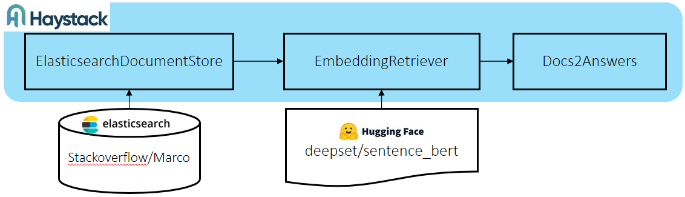

# ODQA with StackOverflow dataset
This guide introduces how to generate the searching database with ElasticSearch and PostgreSQL. It uses [Ray](https://www.ray.io/) to accelerate the indexing speed on multi-nodes. And then deploy search pipeline with web UI.

We use StackOverflow dataset in this guide, users can follow this guide on how to integration your own dataset and model.

## Getting Started
### Step 1. Download the StackOverflow Dataset
 
Download [StackOverflow](https://www.kaggle.com/datasets/stackoverflow/stacksample) dataset

```bash
# create stackoverflow dataset folder
mkdir stackoverflow
cd stackoverflow
# copy downloaded StackOverflow dataset into stackoverflow dataset folder
```

### Step 2. Download the Colbertv2.0 Model (Optional)
 **Note:** 
 If you will not try the colbert pipelines, skip it.
```bash
# download the colbert model and build the haystack-ray image
wget https://downloads.cs.stanford.edu/nlp/data/colbert/colbertv2/colbertv2.0.tar.gz
tar -xvzf colbertv2.0.tar.gz
```

## Run Indexing Pipeline
First make sure you are in `applications/indexing` folder of the repo

```bash
cd applications/indexing
```

### Step 1. Modify the indexing workflow template

Refer to stackoverflow_indexing_workflow.yml. The YAML file must include a head node. The head node should be your local machine which launches the indexing workflow. You can add the worker node under the nodes component.
The pipelines component declares the pipelines that need to be executed, and declares the database used by each pipeline. The YAML files of these pipelines are included in $workspace_dir which is ./stackoverflow_indexing for stackoverflow dataset.

```bash
nodes:
  - node: $host_ip # IP address of head node. Head node is launched in local machine,
    type: head # value:[head, worker] Must exist.
    cores: $core_range #for example 0-7
    image: intel/ai-workflows:odqa-haystack-api
    dataset_dir: $dataset_dir #mount to /home/user/dataset of container. It should include the dataset files.
    customer_dir: $customer_dir #mount to /home/user/data of container
    workspace_dir: $workspace_dir #mount to /home/user/workspace of container. $workspace_dir should be ./stackoverflow_indexing for stackoverflow indexing.

  - node: $host_ip # IP address of worker node.
    type: worker
    image: intel/ai-workflows:odqa-haystack-api
    cores: $core_range #for example 0-7
    user: $user         #configure the user name of worker node for remote access
    password: $password #configure the password of worker node for remote access and sudo executing
    dataset_dir: $dataset_dir #If you use the nfs share storage, it should be same with path of head node.
    customer_dir: $customer_dir  #If you use the nfs share storage, it should be same with path of head node.
    workspace_dir: $workspace_dir  #If you use the nfs share storage, it should be same with path of head node.
 
pipelines: 
  - name: colbert_indexing_pipeline.yml #The name should be same with file name of pipeline file which is included in $workspace_dir
    database: # The database containers will be launched in head node.
      type: elasticsearch # value:[elasticsearch, postgres]. Must be consistent with the database type of DocumentStore configured in the pipeline file 
      image: elasticsearch:7.9.2 #For elasticsearch, the 7.9.2 is prefered. To change the version, you need to ensure that you use the same version as the query pipeline
      cores: $core_range
      data_dir: $data_dir #The data directory of database which mountes to /usr/share/elasticsearch/data of elasticsearch container, or /var/lib/postgresql/data of postgresql container
  - name: emr_indexing_pipeline.yml
    database:
      type: elasticsearch
      image: elasticsearch:7.9.2
      cores: $core_range
      data_dir: $data_dir
  - name: faiss_indexing_pipeline.yml
    database:     # The database containers will run in head node.
      type: postgres
      image: postgres:14.1-alpine
      cores: $core_range
      data_dir: $data_dir
```

 Directories mounted to head and worker containers.
 -  $workspace_dir:

    Mount point: /home/user/workspace

    Include the pipeline YAML files, prepare_env.sh and python file of dataset class for preprocessing and converting dataset data to documents or files of Ray dataset.

    **Note:**
    Pipeline YAML files and prepare_env.sh cannot be placed in subfolders of $workspace_dir.

    For example:
    ```bash
    $ ls ./marco_indexing
    colbert_indexing_pipeline.yml  emr_indexing_pipeline.yml  faiss_indexing_pipeline.yml  marco_dataset.py  prepare_env.sh
    ```

 -  $customer_dir:

    Mount point: /home/user/data

    The log will be saved in the directory. You also can copy your model into this direcotry. For example, indexing workflow of colbert_indexing_pipeline.yml needs the downloaded [colbertv2.0 model](https://downloads.cs.stanford.edu/nlp/data/colbert/colbertv2/colbertv2.0.tar.gz). Copy colbertv2.0 folder into this directory.
 -  $dataset_dir:

    Mount point: /home/user/dataset

    The directory include the dataset files.

Directories mounted to database container.
-   $data_dir 

    if $data_dir is not exist, it will be created. Please use different directory path for different pipeline.

### Step 2. Modify the Indexing Pipeline YAML Files

In pipeline YAML files there are some parameters need to be modified. These pipeline YAML files is under your $workspace_dir. 

For example：

./stackoverflow_indexing/colbert_indexing_pipeline.yml
./stackoverflow_indexing/emr_indexing_pipeline.yml 
./stackoverflow_indexing/faiss_indexing_pipeline.yml

Edit these YAML files according to your local runtime environment.

- For DocumentStore you need to specify the address of the linked database. The $host_name should be the hostname or host IP of head node, because the database container is launched on head node.


  ElasticsearcDocumentStore:
  ```bash
  - name: DocumentStore
    type: ElasticsearchDocumentStore
    actor: True
    params:
      host: $host_ip
  ```
  FAISSDocumentStore:
  ```bash
  - name: DocumentStore
    type: FAISSDocumentStore
    faiss_index_path: /home/user/data/faiss-index-so.faiss
    actor: False
    params:
      sql_url: postgresql://postgres:postgres@$host_ip/haystack
      faiss_index_factory_str: HNSW
  ```
- Check the files path of $customer_dir and $dataset_dir. They are mounted into containers of Ray head and workers. They should include the dataset files or finetuned models downloaded by yourself. If there are subdirectories in these directories, please modify the corresponding path.

  For example:

  stackoverflow_indexing/faiss_indexing_pipeline.yml
    ```bash
    - name: Dataset
      type: StackoverflowDataset
      path: /home/user/workspace/stackoverflow_dataset.py
      actor: False
      params:
        file: /home/user/dataset/train_v2.1.json
        batch_size: 200000
    ```

  stackoverflow_indexing/colbert_indexing_pipeline.yml
    ```bash
    - name: Ranker
      type: ColBERTRanker
      actor: True
      params:
        model_path: /home/user/data/colbertv2.0
      ...
    - name: Dataset
      type: StackoverflowDataset
      path: /home/user/workspace/stackoverflow_dataset.py
      actor: False
      params:
        file: /home/user/dataset/train_v2.1.json
        batch_size: 200000
    ```

  stackoverflow_indexing/emr_indexing_pipeline.yml
    ```bash
    - name: Dataset
      type: StackoverflowDataset
      path: /home/user/workspace/stackoverflow_dataset.py
      actor: False
      params:
        question_file: /home/user/dataset/Questions-S.csv
        answer_file: /home/user/dataset/Answers-S.csv
        batch_size: 200000
    ```
- Adjust the actor numbers and batch_size according to the hardware resource of the Ray cluster. Too large actor numbers and batch_size may cause out of memory. The num_replicas x num_cpus should be less than the total number of CPUs you configured in the indexing workflow YAML.

  ```bash
  serve_deployment_kwargs:
      num_replicas: 80  # number of actors to create on the Ray cluster
      batch_size: 256
      num_cpus: 2
  ```

### Step 3. Generate the Stackoverflow Database
Launch the Ray cluster for indexing workflows.
```bash
#Launch Ray cluster for stackoverflow indexing workflow
$ python launch_indexing_workflow.py -w stackoverflow_indexing_workflow.yml
```

Run the indexing workflows on Ray cluster. The -p option value is the name of pipeline YAML file or all.

 **Note:**
 For faster debugging and demonstration demo, you can choose the Marco dataset and use the -s option to take only 500 samples from dataset for indexing

```bash
#Run all pipelines defined in stackoverflow_indexing_workflow.yml
$ python launch_indexing_workflow.py -w stackoverflow_indexing_workflow.yml -p all

#Run faiss_indexing_pipeline.yml defined in the stackoverflow_indexing_workflow.yml
$ python launch_indexing_workflow.py -w stackoverflow_indexing_workflow.yml -p faiss_indexing_pipeline.yml

#Run faiss_indexing_pipeline.yml defined in the stackoverflow_indexing_workflow.yml, only take 500 samples from dataset for indexing pipeline debugging or demo.
$ python launch_indexing_workflow.py -w stackoverflow_indexing_workflow.yml -p faiss_indexing_pipeline.yml -s 1
```

After generating the database of Faiss pipeline, copy and save the indexing files of $customer_dir to avoid them being overwritten by the new faiss indexing workflow.

Clean previous containers you have ran, you can use following commands on all nodes of your Ray cluster.

```bash
# Clean all the Ray and database containers running in local node.
$ ./run-ray-cluster.sh -r clean_all
# Clean all the database containers running in local node.
$ ./run-ray-cluster.sh -r clean_db
```

## Run Search Pipeline
First make sure you are in `applications/odqa-pipelines` folder of the repo

```bash
cd applications/odqa_pipelines
```

### Option 1. Run EMR Pipeline
>Note: Please make sure you have completed emr_indexing_pipeline.yml indexing pipeline

ElasticsearchDocumentStore->EmbeddingRetriever(deepset/sentence_bert)->Docs2Answers
  
<p align="center"> <br></p>
  
Modify the config file `config/env.stackoverflow.esds_emr_faq`

```bash
# set the $data_dir to the data folder of elasticsearch database, please refer to applications/indexing/stackoverflow_indexing_workflow.yml
DATA_DIR=$data_dir 
```

Run workflow: 

```bash
#deploy search pipeline with stackoverflow database
docker-compose -f docker-compose/docker-compose.yml --env-file config/env.stackoverflow.esds_emr_faq up
```

### Option 2. Run Cobert Pipeline
>Note: Please make sure you have completed colbert_indexing_pipeline.yml indexing pipeline

ElasticsearchDocumentStore->BM25Retriever->ColbertRanker-> Docs2Answers

<p align="center"> <br></p>

Modify the config file `config/env.stackoverflow.esds_bm25r_colbert`

```bash
# set the $data_dir to the data folder of elasticsearch database, please refer to applications/indexing/stackoverflow_indexing_workflow.yml
DATA_DIR=$data_dir
# set the $customer_dir to the absolute ColbertV2.0 model path you placed
CUSTOMER_DIR=$customer_dir
```

Modify the docker compose file `docker-compose/docker-compose.yml`, uncomment the following lines.
```bash
  #volumes:
  #  - $CUSTOMER_DIR:/home/user/data
```

Run workflow:

```bash
#deploy search pipeline with stackoverflow database
docker-compose -f docker-compose/docker-compose.yml --env-file config/env.stackoverflow.esds_bm25r_colbert up
```

### Option 3. Run DPR Pipeline
>Note: Please make sure you have completed faiss_indexing_pipeline.yml indexing pipeline

FAISSDocumentStore->DensePassageRetriever->Docs2Answers

<p align="center"> <br></p>

Modify the config file `config/env.stackoverflow.faiss_dpr`

```bash
# set the $data_dir to the data folder of postgresql database, please refer to applications/indexing/stackoverflow_indexing_workflow.yml
DATA_DIR=$data_dir
# set the $customer_dir to the absolute path where you store faiss indexing files.
CUSTOMER_DIR=$customer_dir
```

Modify the docker compose file `docker-compose/docker-compose-dpr.yml`, uncomment the following lines.

```bash
  #volumes:
  #  - $CUSTOMER_DIR:/home/user/data
```

Run workflows:

```bash
#deploy search pipeline with stackoverflow database
docker-compose -f docker-compose/docker-compose-dpr.yml --env-file config/env.stackoverflow.faiss_dpr up 
```

## Expected Output
Once you deployed search pipeline successfully, open a browser and input following url to access web UI

```bash
<host_ip>:8501
```